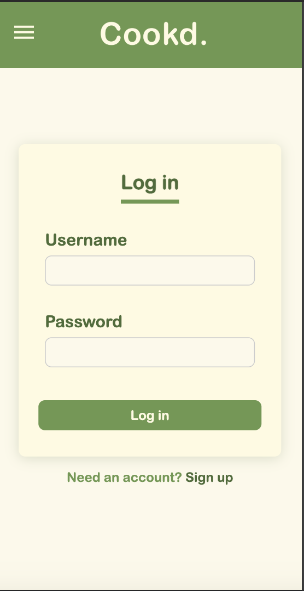

# Cookd

## Overview

Cookd is a recipe app; its main focus is to allow users to organise and store recipes in ‘cookbooks’.

### Problem

As a self-proclaimed “foodie”, I enjoy ripping pages out from magazines and scouring the internet for new recipes; however, these recipes end up being lost and forgotten either in my physical recipe ringbinder, or in the depths of my camera roll. On the rare occasion I do end up trying a new recipe, more often than not I forget which previous recipes I enjoyed.

### User Profile

The main users of this app will be those with an interest in cooking and trying new recipes between the ages of 18~40 years old. This app can be a companion to pre-existing cookbooks and recipes the user has, but has an intention of aiding in organisation.

### Features

- The user will sign-up to the app, creating a personal account which is unique to the user. This will include a unique username and a password. The user will then use these details to access their account, which will hold all of their recipes.
- The user will be able to create a new recipe; this recipe must include a list of ingredients, including their individual amounts, and a method. Optionally, the user can include the type of cuisine it is, the cooking duration, and the number of servings the recipe yields.
- The user will be able to delete recipes; this will be a permanent function and the user will not be able to recover any deleted recipes.
- The user will be able to edit recipes; this will allow them to edit a pre-existing recipe, and then permanently edit that recipe to reflect the updated changes.
- The user will be able to collect groups of recipes and put them into a singular “cookbook”; the themes surrounding each individual “cookbook” will be at the discretion of the user, but they will be able to make an unlimited amount of “cookbooks”.

## Implementation

### Tech Stack

- Git
  - I will be using Git as a ‘diary’ of my progress creating the app; not only will Git allow me to document the process of the app creation through meaningful commit messages, it will also provide a backup of my code incase I encounter any drastic issues during the coding process and need to revert to a previous version of the codebase. Since I have used it many times, it is the method of version control that I am most comfortable with.
- React (create-react-app)
  - I will be using React in order to create the front-end UI of the app; React has many in-built hooks (e.g. useEffect) and utilises state, which will be incredibly useful to render the most up-to-date data from the database and create a seamless and clean user experience with the app.
  - In order to set-up my app codebase quickly, I will be using the ‘create-react-app’ bootstrap. This will reduce the complexity and time required to initialise the file structure of the app.
- React-router
  - React-router will allow me to create the illusion of multiple-pages (despite technically being a SPA), and give navigation functionality to my app through client-side routing.
- React-icons
  - To reduce time in gathering assets, I will be using the 'react-icons' library for the use of icons in my styling; these icons will give visual cohesion to my app and will be accessible to a variety of users due to their universal meanings.
- Node.js & Express
  - I will be using both Node.js and Express in order to manipulate the API/database of my application.
- MySQL
  - I will be creating the actual database using MySQL in the terminal. Refer to both ‘APIs’ and ‘Data’ section of this document for further details on the structure of the database and the relationships between the tables.
- Knex.js
  - I will use Knex.js in order to be able to work with the database created in MySQL. Since directly coding in SQL is quite difficult, I will use the abstraction that Knex.js provides to my advantage to make the coding for database manipulation a quicker and more streamlined process.
- bcrypt
  - I will use the bcrypt library to allow me to encrypt user's passwords when stored in the database; this is to add extra security for the user's login details, meaning that hypothetically if someone did access the database, they would not be able to access a user's account with the information found.
- jsonwebtoken
  - I will be using jsonwebtoken in order to implement authentication in my app.
- SASS
  - By using BEM naming conventions, SASS will be an effective method to style my application. Since the app will be using HTML elements, I will be able to target these elements not only through their appropriate and meaningful class names and ids, but also directly through the HTML element themselves.
  - I will be creating appropriate mixins, variables, resets, typography, and global partials in order to keep my styling DRY.

### APIs

I intend on creating my own API to store the required data from the app; there will be a database consisting of 5 tables - users, recipes, cookbooks, ingredients, and instructions. One user will be able to create multiple recipes and cookbooks. One recipe can be in many cookbooks, and one cookbook can contain many recipes. A single ingredient will belong to one recipe, but one recipe can have many ingredients. Additionally, a single instruction will belong ot once recipe, but one recipe can have many instructions
In this project, I will not be using a third-party/external API; this is because I believe it will be easier to create my own, and thus know the structure of the data, versus using an external API and having to understand documentation and the API structure itself. Although creating my API should not be too laborious of a task, it will still take time; this could be considered a disadvantage however I believe it is a net-positive choice as the pros outweigh the cons.

### Sitemap

- Login Page - this is where the user will be prompted to log into their account, providing a username and password
  - Checking the login details against values stored in the API
- Dashboard - this will have the user’s recipes, and cookbooks
  - Cookbooks will appear first
  - Click on cookbook and it will "open" the cookbook, displaying the cookbook-specific recipes
  - Recipes will be displayed as a recipe cards, both on the dashboard and in the cookbook
  - The user will be able to edit and delete the recipe via the recipe card
  - The user will be able to edit and delete the cookbook via the cookbook card

### Mockups

For all of my mockups, I drew what the screens would look like on a mobile screen; since my application would realistically be a Native app, I have made the decision to focus only on mobile styling as this semantically is a better choice.

In the recipe card, there will be a recipe title, image and a section of ‘recipe details’. These details will include the cooking duration, serving size, type of cuisine, ingredients, instructions and ‘review’ of the recipe. The review option will be able to be edited once the recipe has been created and will be implemented as a PATCH/UPDATE to the API. In the review, the user will score the recipe out of 5 as an integer, and this will be represented via icons on the screen (in the drawing it is through heart icons, but this is not currently definite). In addition to the numerical review, the user will be able to add additional comments to the recipe.
As a ‘nice to have’, the user can upload an image to represent their recipe; in the case they do not upload an image (or if I am not able to implement this functionality), a hard-coded default image will be used instead.

Both the ‘add new recipe’ and ‘edit recipe’ components will follow the exact same styling (apart from different titles); for the ‘edit recipe’ component however, it will render the form already populated with the recipe’s data from the database.
Similarly, the ‘create new cookbook’ and ‘edit cookbook’ components will follow similar styling and structure; the fields will consist of a cookbook name, and the recipes the user wishes to add / has already added to the cookbook.
Although not presented in the diagram, as a ‘nice to have’ the user could upload an image for their recipe. This was accounted for in the ‘recipe card’ component, but if I am unable to account for this functionality, a singular image will be hard-coded into the system to represent all recipes.

### Data

### Endpoints

- /api/users
  - / = gets the user's information
  - /:id = deletes the user
- /api/recipes
  - /users/:id = gets all the recipes from a given user
  - /users/nocookbooks/:id = gets all the non-cookbook recipes from a given user
  - /:id = gets a single recipe
  - /add = creates a new recipe
  - /update = edits the recipe when it is added to a cookbook
  - /edit = edits the recipe
- /api/ingredients
  - /:id = gets the ingredients of a given recipe
  - /add = creates ingredients (upon recipe creation)
  - /edit = edits ingredients (upon recipe edit)
- /api/instructions
  - /:id = gets the instructions of a given recipe
  - /add = creates instructions (upon recipe creation)
  - /edit = edits instructions (upon recipe edit)
- /api/cookbooks
  - /users/:id = gets all the cookbooks by a given user
  - /:id = gets a single cookbook
  - /:id/delete = deletes a single cookbook
  - /:id/recipes = gets all the recipes from a single cookbook
  - /add = creates a new cookbook
- /api/auth
  - /login = log the user into the app, provide an auth token which will be stored in session storage
  - /details = checks the auth token's validity
  - /register = add a new user to the DB

### Auth

- Users will sign up to the system using an email address and password
  - Using the front-end the user MUST submit an email address, username and password; the email address must include the ‘@’ symbol, the usernames and email addresses must be unique (i.e. one email address per account, unique username), and the password must be at least 8 characters long.
  - Using the back-end, the database will not create a user with the same details and will only make a user if the correct inputs are given (i.e. email and usernames will both be marked as unique, emails, usernames and passwords will all be not nullable).
  - When signing up, the user will need to input their password twice (i.e. ‘password’ and ‘confirm password’ input fields in the form); in order to sign up successfully, the user will need to ensure that both of these fields match.
- Once signed up, the user will use their email/username and password in order to log into the system
  - The email address must be linked to an existing user in the database.
  - The password must match the corresponding password of the user associated with the email.
  - Passwords will be case-sensitive, however email/usernames will not (they will be converted to lowercase before being posted into the system, and read as lowercase when being gotten).
- As mentioned previously, I will be using JSONWebToken for auth, alongside using bcrypt for encryption of passwords.

## Roadmap

Below is a list of the tasks that will need to be completed in order to deliver a cohesive final solution; I intend to start with the back-end, creating a reliable database and establishing functioning API requests, and then will move onto front-end, focusing first on the functionality and then moving onto styling and responsively designing each component.

- Front-end
  - Initial folder structure (incl. assets) & git repo
  - SASS variables, mixins, breakpoints, colours and font-face
  - React router
  - Navigation bar
  - Recipe card component
  - Add new recipe component
  - Edit recipe component
  - Cookbook component (i.e. recipe list)
  - Add new cookbook component
  - Delete recipe modal
  - Delete cookbook modal
- Back-end
  - Initial folder structure & git repo
  - Database creation & connection with Knex
  - Knex migrations and seeds
  - Auth for Sign up
  - Auth for Logging in
  - API to GET a single user
  - API to GET a single recipe
  - API to GET a single cookbook
  - API to GET all recipes made by a given user
  - API to GET all cookbooks made by a given user
  - API to GET all non-cookbook recipes made by a given user
  - API to POST/CREATE a new user
  - API to POST/CREATE a new recipe
  - API to POST/CREATE a new cookbook
  - API to DELETE a single user
  - API to DELETE a single recipe
  - API to DELETE a single cookbook
  - API to PATCH/UPDATE a single recipe
  - API to PATCH/UPDATE a recipe with a cookbook (i.e. PATCH the cookbook_id)
- Other
  - Project-wide testing
  - Nice-to-haves
  - Final fixes

## Nice-to-haves

- After trying a new recipe, the user will be prompted to review it; the review will include the 5-star rating system as well as an optional comments section, where they can include any changes they’d make and their general thoughts about the recipe.
- If the user has not cooked a highly-rated recipe in a long time, OR if they haven’t tried a new recipe yet, they will receive a reminder to either cook the highly-rated recipe again or try the new recipe.
- The user will be able to make a ‘menu board’, which will hold the recipes that the user wants to cook throughout the week.
- Users will be able to share recipes between other users; each user will have a public ‘pin-board’ style page where they can share recipes for the public to see. Additionally, there will be a direct messaging feature, where users can directly send recipes to others.
- Users will be able to create collaborative “cookbooks” where they can collaboratively access and edit collections of recipes. For security, these “cookbooks” will require a password in order to access and edit.
- Based upon the weekly menu-board, the app will generate a shopping list which will include all the items the user will need in order to create all of the selected recipes.
  - The system will sort the grocery list generated from the menu board into 3 sections - ‘fresh’, ‘frozen’ and ‘ambient’. Additionally, the system will find out which supermarket(s) sell which items the cheapest, so the user can make the best economical choice.
- Based upon pre-existing records and information, the system will automatically calculate the calories, macronutrients and micronutrients of a given recipe. The user will also be able to input their calorie limit and macronutrient split; based upon this input, the system will let them know if the selected meals are allowed within their current nutrition requirements.

## Installation Guide - Front End

- Upon downloading the git repository you must run the following commands:
  - npm i
  - npm i sass
  - npm i react-router-dom
  - npm i react-icons —save
  - npm i axios
  - npm i dotenv
- Environment variables will also need to be set up in the same format as shown below:
  
- Since this application is designed for mobile view, please view the application at a width of 375px; this can be achieved via ‘Mobile M’ in Google Chrome DevTools when inspecting.

## Installation Guide - Back End

- Upon downloading the git repository you must run the following commands:
  - npm i
  - npm i express
  - npm i knex
  - npm i cors
  - npm i dotenv
  - npm i jsonwebtoken
  - npm i bcryptjs
  - npm i bcrypt
- Environment variables will also need to be set up in the same format as shown below:
  
- A database will also need to be created - this can be done in the Terminal with MySQL. Please ensure the naming of the database matches the environment variables
- Migrations will need to be run (knex migrate:latest) as well as seed files (knex seed:run)
